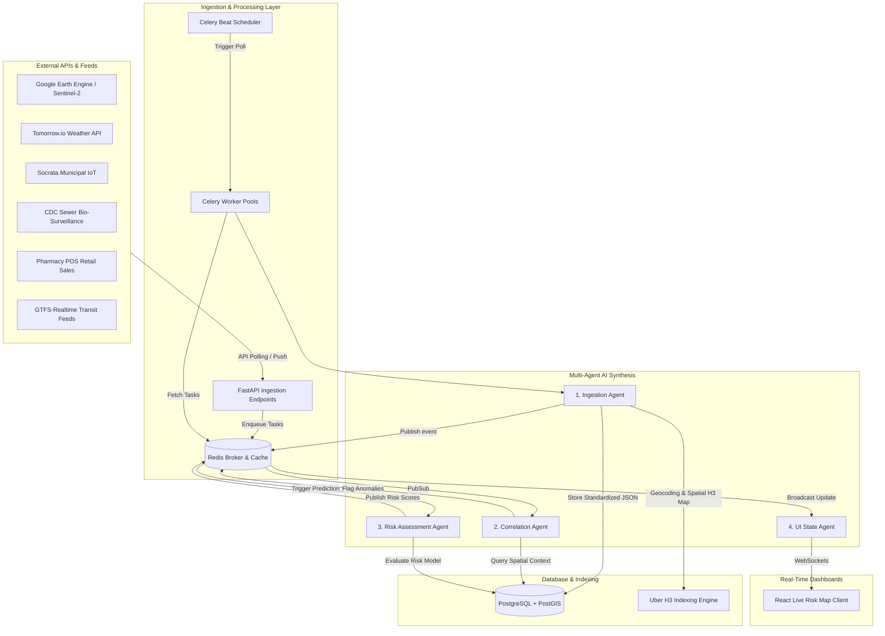

# MetroShield AI – Data Ingestion Layer & Multi-Agent AI Synthesis Blueprint (Simplified Architecture)

This blueprint outlines a simplified, high-performance, and cost-effective data ingestion and multi-agent synthesis architecture for **MetroShield AI**. It replaces expensive enterprise message buses (Kafka/Kinesis) and heavy orchestration engines (Temporal.io) with a modern, lightweight Python-centric stack: **FastAPI**, **Redis** (for messaging and caching), **Celery** (for task scheduling and queueing), and **PostgreSQL with PostGIS** (for spatial persistence).

---

## 1. Problem Statement & Design Objectives
Urban public-health agencies and enterprise stakeholders need **near-real-time, hyper-local predictions** of vector-borne disease risk.
- **Heterogeneous Streams:** Data must be gathered from diverse sources: environmental satellites, municipal infrastructure logs, syndromic bio-surveillance, and transit density APIs.
- **Sub-Kilometer Granularity:** Multi-layer correlation must occur at the city-block scale using Uber's H3 spatial index (Resolution 9, ~0.6 km²).
- **Simplicity & Maintainability:** The target architecture must minimize infrastructure footprint, running reliably with standard, well-supported open-source components that have minimal dev-ops overhead.

---

## 2. System Architecture & Data Flow

Below is the simplified system architecture showing ingestion, processing, multi-agent coordination, and real-time visualization.



---

## 3. Simplified Tech Stack Specification

| Component | Technology | Rationale & Configuration |
| :--- | :--- | :--- |
| **API / Service Layer** | **FastAPI** (Python 3.11+) | Lightweight, high-performance, native support for async operations, WebSockets, and automatic OpenAPI documentation. |
| **Task Queue & Scheduler** | **Celery + Celery Beat** | Standard Python distributed task queue. Celery Beat handles periodic polling (30s to daily intervals). |
| **Broker & State Cache** | **Redis** | Serves as the message broker for Celery, transient cache for H3 grid states, and Pub/Sub channel for agent communication. |
| **Spatial Database** | **PostgreSQL + PostGIS** | Relational data persistence with native geospatial query support. Indexes the H3 cells, stores historical inputs, and maintains risk logs. |
| **Spatial Indexing** | **Uber H3 (h3-py)** | Groups geographic coordinates into hexagon cells at **Resolution 9** (~0.6 km²) to provide a uniform spatial grid. |
| **Agent Logic & ML** | **Python (Scikit-Learn / XGBoost)** | Instead of full TensorFlow-Serving infrastructure, lightweight inference runs inside Python workers using compiled ONNX or Scikit-learn/XGBoost models. |

---

## 4. The 4 Core Data Streams & API Integration

External adapters are implemented as async Celery tasks triggered by **Celery Beat**. They normalize raw payloads into GeoJSON format, calculate the matching H3 index, and write to PostgreSQL.

| Data Stream | Source API | Frequency | Extracted Data Fields | Normalized GeoJSON Extension |
| :--- | :--- | :--- | :--- | :--- |
| **Environmental & Micro-Climate** | Sentinel-2 (GEE) & Tomorrow.io | Daily (satellite) & Hourly (weather) | Surface water flags (NDVI/MNDWI), Air Temp, Humidity, Heat Index | `{"h3_index": "892a3bffffffffff", "water_presence": true, "temp_c": 33.5}` |
| **Civil Infrastructure** | Socrata SODA API (Smart Cities) | Every 15 min | Storm drain blockages, sewer levels, IoT pump diagnostic codes | `{"h3_index": "892a3bffffffffff", "drain_status": "clogged", "flow_rate": 0.12}` |
| **Syndromic & Bio-Surveillance** | CDC NWSS & Pharmacy Retail APIs | Daily (sewer) & Hourly (retail sales) | Viral load (copies/L), OTC fever/rash medication sales spikes | `{"h3_index": "892a3bffffffffff", "viral_copies_l": 180000, "fever_med_sales": 124}` |
| **Urban Mobility** | GTFS-Realtime Feeds | Every 30 seconds | Transit passenger density metrics, vehicle position clusters | `{"h3_index": "892a3bffffffffff", "density_score": 42}` |

---

## 5. Multi-Agent AI Synthesis & Workflow

The ingestion pipeline uses a sequence of dedicated **Python Class Agents** coordinated via Celery and Redis Pub/Sub:

### 5.1 Ingestion Agent
- **Responsibility:** Triggered when raw data is received. Validates schema, translates latitude/longitude to a Resolution 9 H3 index using `h3.geo_to_h3(lat, lng, 9)`, and saves the record to PostGIS.
- **Database Schema (Ingested Event):**
  ```sql
  CREATE TABLE standardized_stream_data (
      id UUID PRIMARY KEY DEFAULT gen_random_uuid(),
      h3_index VARCHAR(15) NOT NULL,
      stream_type VARCHAR(30) NOT NULL,
      timestamp_utc TIMESTAMP WITHOUT TIME ZONE NOT NULL,
      payload JSONB NOT NULL,
      geom GEOMETRY(Geometry, 4326)
  );
  CREATE INDEX idx_stream_h3 ON standardized_stream_data (h3_index);
  CREATE INDEX idx_stream_timestamp ON standardized_stream_data (timestamp_utc DESC);
  ```

### 5.2 Correlation Agent
- **Responsibility:** Periodically aggregates standard datasets over a 15-minute sliding window per active H3 cell. Detects overlapping risk indicators (e.g., standing water + high heat + sewer blockage in H3 cell `892a3bffffffffff`).
- **Logic:** Evaluates predefined rules. If critical thresholds are crossed, publishes a `correlation.anomaly` event to Redis.

### 5.3 Risk Assessment Agent
- **Responsibility:** Listens for `correlation.anomaly` events. Loads historical data for the H3 cell, executes a lightweight XGBoost risk model, outputs a probability score ($0.0$ to $1.0$), and saves it to PostgreSQL.
- **Database Schema (Risk Output):**
  ```sql
  CREATE TABLE risk_scores (
      h3_index VARCHAR(15) PRIMARY KEY,
      timestamp_utc TIMESTAMP WITHOUT TIME ZONE NOT NULL,
      score DOUBLE PRECISION NOT NULL,
      confidence_interval_low DOUBLE PRECISION NOT NULL,
      confidence_interval_high DOUBLE PRECISION NOT NULL,
      trigger_reasons TEXT[] NOT NULL
  );
  ```

### 5.4 UI State Agent
- **Responsibility:** Subscribes to the `risk_scores` channel on Redis. When a new score is written, retrieves active WebSocket connections from FastAPI memory, filters by user bounds, and streams a GeoJSON payload directly to connected React clients.

---

## 6. Sample Correlated Risk Event (JSON Payload)

```json
{
  "event_id": "c6e5f2b9-4d21-44a7-9f1a-8b2c7e6d9f3a",
  "h3_index": "892a3bffffffffff",
  "timestamp_utc": "2026-06-25T13:45:00Z",
  "layers": {
    "environment": {
      "water_presence": true,
      "temperature_c": 33.5,
      "heat_index_c": 38.2
    },
    "infrastructure": {
      "storm_drain_status": "clogged",
      "flow_rate_lps": 0.12
    },
    "bio_surveillance": {
      "viral_load_copies_per_liter": 180000.0,
      "otc_fever_med_sales": 124
    },
    "mobility": {
      "transit_hub_density": 42,
      "last_vehicle_ts": "2026-06-25T13:43:12Z"
    }
  },
  "correlation_rules": [
    {
      "rule_id": "R-BIO-WATER-HEAT-01",
      "description": "Active standing water + clogged storm drain + local heat岛 anomaly + bio-surveillance signal detected",
      "triggered": true
    }
  ],
  "risk_score": 0.84,
  "risk_assessment": {
    "model_version": "v1.0.0-lightweight",
    "confidence_interval": [0.78, 0.90],
    "recommended_action": "Dispatch municipal maintenance to clear storm drains and coordinate chemical vector treatment in block."
  }
}
```

---

## 7. Operational & Production-Readiness Checklist

- [ ] **Docker Compose Config:** Containerize FastAPI, Redis, and PostgreSQL/PostGIS for one-command deployment.
- [ ] **Index Optimizations:** Apply B-Tree indexes on `h3_index` and PostgreSQL GIST spatial index on geometry columns.
- [ ] **Rate Limiting & Retries:** Configure Celery tasks with exponential backoff (`max_retries=5`, `countdown=60`) to handle external API failures gracefully.
- [ ] **WebSocket Broadcast Management:** Implement a simple connection manager in FastAPI with ping/pong keep-alives to prune dead browser connections.
- [ ] **Data Retention Policies:** Run a daily Celery maintenance task to archive raw inputs older than 30 days to keep the operational database size minimal and fast.
