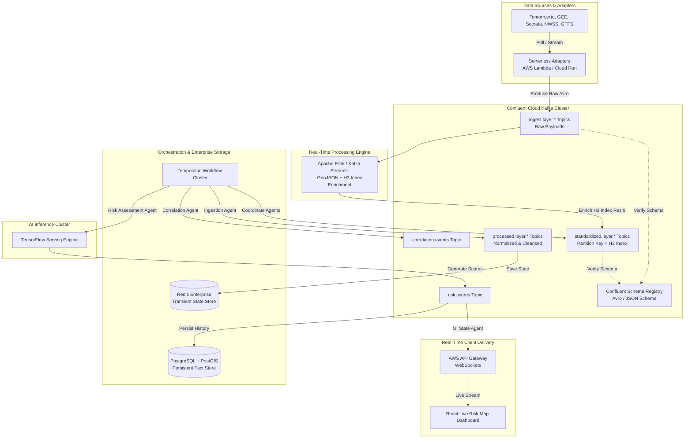

# MetroShield AI – Data Ingestion Layer & Multi-Agent AI Synthesis Blueprint (Enterprise Architecture)

This blueprint outlines the production-grade, enterprise-scale data ingestion and multi-agent synthesis architecture for **MetroShield AI**. It utilizes an event-driven streaming backbone (**Apache Kafka / Confluent Cloud**), schema enforcement, stream processing (**Apache Flink / Kafka Streams**), and robust workflow orchestration (**Temporal.io**) to achieve reliable, sub-kilometer, near-real-time predictions of vector-borne disease risk.

---

## 1. Problem Statement
Urban public-health agencies and commercial real-estate stakeholders need **near-real-time, hyper-local predictions** of vector-borne disease risk. Existing systems are fragmented:
- Geospatial, environmental, infrastructure, bio-surveillance, and mobility data arrive from heterogeneous APIs.
- Data are in disparate coordinate systems, frequencies, and schemas.
- Correlating these signals across a city block in **sub-kilometer granularity** is computationally prohibitive.
- Reactive dashboards cannot scale to city-wide, sub-hourly updates.

The challenge is to build a **robust, production-grade ingestion pipeline** that normalizes, indexes, and streams these multi-domain signals to a set of autonomous agents that can **clean**, **correlate**, **score risk**, and **push live updates** to enterprise dashboards.

---

## 2. Enterprise System Architecture

Below is the enterprise system architecture illustrating the resilient streaming and orchestration topology.



---

## 3. Data Architecture & Ingestion Strategy

### 3.1 Event-Driven Streaming Backbone
- **Message Bus:** Apache Kafka (Confluent Cloud) with an optional AWS Kinesis fallback for decoupling producers and consumers. Topics named `ingest.<layer>.<source>`. Partitions are keyed by H3 index to guarantee data locality. Log compaction is enabled on key, with a 30-day hot retention policy and S3/Glacier archival.
- **Schema Registry:** Confluent Schema Registry (Avro/JSON) enforcing **FULL** backward/forward compatibility.
- **Security:** mTLS for inter-service communication, IAM ACLs, and AWS KMS encryption-at-rest.
- **State Store:** Redis Streams (transient cache) + PostgreSQL with PostGIS (persistent risk scores & historical spatial telemetry).
- **Orchestrator:** Temporal.io (Cloud/Self-hosted) guaranteeing activity retries, workflow crons, and signal handling.

### 3.2 Standardization Protocol
1. **Producer:** Writes raw payload to `ingest.*` topics using an Avro envelope.
2. **Normalization Service:** (Kafka Streams/Flink) validates against the registry, converts coordinates to GeoJSON, normalizes timestamps to UTC, and enriches with `h3_index` via the Uber H3 spatial index.
3. **Output:** Produced to `standardized.<layer>` (key = H3 index).

### 3.3 Spatial Indexing with Uber H3
- **Resolution 9** (~0.6 km²) is utilized as the baseline spatial resolution, offering an optimal balance between spatial granularity and event processing throughput.
- Index generated via `h3.geoToH3(lat, lng, 9)`.
- Neighborhood queries utilize `h3.kRing(index, 1)` cached in Redis for fast spatial association.
- Persisted in a **PostGIS** spatial table for historical spatial analytics.

---

## 4. API Integration Specifications

All external APIs are accessed via serverless adapters (AWS Lambda / Cloud Run) that publish raw JSON to the appropriate `ingest.*` topic.

| Layer | Source | Endpoint | Frequency | Normalized Schema (excerpt) |
|---|---|---|---|---|
| **Environmental** | Google Earth Engine / Sentinel-2 | `https://earthengine.googleapis.com/...` | Daily (nightly) | `{ "geojson": {...}, "ndvi": float, "water_presence": bool }` |
| | Tomorrow.io | `https://api.tomorrow.io/v4/timelines?...` | Hourly | `{ "temperature": float, "humidity": float, "heat_index": float }` |
| **Infrastructure** | Municipal Smart City (Socrata SODA) | `https://city.gov/api/containers/{resource_id}` | 15 min | `{ "sensor_id": string, "flow_rate": float, "status": "normal\|clogged", "location": {"lat":..., "lng":...} }` |
| **Bio-Surveillance** | CDC NWSS | `https://api.cdc.gov/nwss/v1/measurements?...` | Daily | `{ "virus": "SARS-CoV-2\|Dengue\|WNV", "copies_per_liter": float }` |
| | Pharmacy POS | `https://partner.pharmacy.com/api/v2/sales?...` | Hourly | `{ "product_category": string, "units_sold": int, "store_location": {"lat":..., "lng":...} }` |
| **Mobility** | GTFS-Realtime | `https://gtfs-realtime.api/{agency}/vehiclePositions.pb` | Every 30 s | `{ "vehicle_id": string, "position": {"lat":..., "lng":...}, "timestamp": ISO8601 }` |

---

## 5. Multi-Agent AI Logic & Workflow Orchestration

### 5.1 Common Runtime
- **Temporal.io** workflow engine manages execution, state preservation, and reliable retries.
- **Communication:** Decoupled via Kafka topics (`agent.<name>.*`) and Temporal signals.

### 5.2 Agents

| Agent | Responsibility | Input Topics | Output Topics | Key State |
|---|---|---|---|---|
| **Ingestion Agent** | Clean payload, UTC normalize, map to H3, enrich with weather forecasts | `standardized.*` | `processed.<layer>` (key = H3) | `last_seen_ts`, `quality_flag` |
| **Correlation Agent** | Apply Drools/DSL rule engine, detect multi-layer patterns in the same H3 cell | `processed.*` (aggregated per H3) | `correlation.events` (key = H3) | `active_rules` per H3 |
| **Risk Assessment Agent** | TensorFlow-Serving model $\rightarrow$ probability 0-1 | `correlation.events` | `risk.scores` (key = H3) | `score_history` (rolling window) |
| **UI State Agent** | Broadcast via AWS API Gateway WebSockets to React dashboard | `risk.scores` | `ui.updates` (WebSocket) | `client_subscriptions` per tenant |

### 5.3 Coordination & Resiliency Flow
- Each Temporal activity is guaranteed to be **idempotent**. State checkpoints are persisted in the Temporal DB.
- Back-pressure is applied if downstream `risk.scores` lag exceeds 30 seconds by pausing Kafka consumers.
- Autoscaling is managed via Kubernetes Horizontal Pod Autoscaler (HPA) based on custom Kafka consumer lag metrics.

---

## 6. Sample Correlated Risk Event (JSON)

```json
{
  "event_id": "c6e5f2b9-4d21-44a7-9f1a-8b2c7e6d9f3a",
  "h3_index": "892a3bffffffffff",
  "timestamp_utc": "2026-06-24T18:00:00Z",
  "layers": {
    "environment": {"water_presence": true, "temperature_c": 33.5, "heat_index_c": 38.2},
    "infrastructure": {"storm_drain_status": "clogged", "flow_rate_lps": 0.12},
    "bio_surveillance": {"viral_load_copies_per_liter": 1.8e5, "otc_fever_med_sales": 124},
    "mobility": {"transit_hub_density": 42, "last_vehicle_ts": "2026-06-24T17:58:12Z"}
  },
  "correlation_rules": [{"rule_id": "R-STD-WATER-CLOG-HEAT-01", "description": "Standing water + clogged storm drain + temperature spike >= 3 °C", "triggered": true}],
  "risk_score": 0.84,
  "risk_assessment": {
    "model_version": "v2.3.1",
    "confidence_interval": [0.78, 0.90],
    "recommended_action": "Dispatch vector control team; issue city-block alert"
  }
}
```

---

## 7. Production-Readiness Checklist

- **Observability:** Prometheus + Grafana dashboards for monitoring Kafka lag, Temporal workflow health, and H3 coverage.
- **Disaster Recovery:** Cross-region Kafka MirrorMaker, DynamoDB global tables / Aurora Multi-Region for persistence.
- **Security:** Zero-trust networking, OAuth 2.0/JWT for client adapters, mTLS on Kafka, and KMS data-at-rest encryption.
- **Compliance:** GDPR-compatible anonymization of location-specific health and mobility telemetry.
- **CI/CD:** GitOps (Argo CD) for infrastructure delivery, Helm charts for microservices, and automated schema-registry linting.
- **Backup:** Daily snapshot of PostGIS database, immutable S3 archive of raw Kafka logs.
